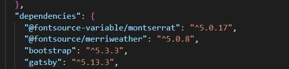

Hay dos maneras principales de usar Bootstrap CSS en un proyecto creado con Gatsby:
(Podrámos poner también cdn pero de momento no lo utilizamos)

1. Instalar  de Bootstrap:

    - Paso 1: Instala Bootstrap desde npm:
````shell
npm install bootstrap
````

   - Paso 2: Importa el archivo CSS de Bootstrap en el archivo principal de tu JavaScript:
src\components\layout.js
````JavaScript
import ' ../../node_modules/bootstrap/dist/css/bootstrap.min.css';
````

   - Paso 3: Usa las clases de Bootstrap en el return de tu componente en tu código jsx:
src\components\layout.js
HTML
````html
   <footer className='text-center'>
        © canodelacuadra, Tandem Aranjuez {new Date().getFullYear()}
      </footer>
````
o directamente en un artículo de un blog en un archivo md, eso sí en html
````html
<div class='alert alert-primary'>
Documentación de Gatsby sobre rutas: https://www.gatsbyjs.com/docs/routing/
</div>
````

